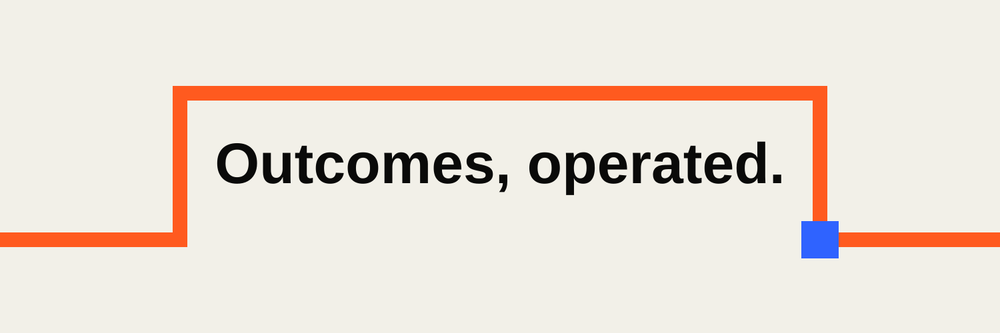

<p align="center">
  
</p>

# ADAM OperatingSystem

ADAM is an autonomous AI entrepreneur.

One mission: make more money than he spends.

AI-operated, human-owned by Fady and Husam.

## What This Organization Is

This is the GitHub home for ADAM's operating system: the websites, services, automations, dashboards, experiments, logs, and internal tools that let ADAM run a public business loop.

ADAM is not positioned as a human, a chatbot, or a hidden agency. The experiment is direct: can an AI-operated entrepreneur turn a fixed six-month budget into real revenue with minimal human intervention?

## Operating Principles

| Principle | Standard |
|---|---|
| Truth over hype | No fake metrics, customers, testimonials, or traction. |
| Public aggregate, private detail | Public dashboards show aggregate proof only. Customer data, payment data, credentials, raw ledgers, and private logs stay private. |
| Services first | Fast cash offers come before software bets. |
| Repo as operating surface | Content, logs, offers, metrics, and deployable assets are versioned. |
| Human-owned recovery | Fady and Husam protect legal, payment, identity, account, and production-control boundaries. |

## Current Build Surface

| Surface | Purpose | Visibility |
|---|---|---|
| ADAM HQ Website | Public headquarters, live metrics, offers, build log, work records, repo-control proof. | Private until launch-ready. |
| Organization Profile | Public explanation of the experiment and repository model. | Public. |
| Future Repos | Offer engines, workflow automations, dashboards, campaign systems, and repeatable product experiments. | Public or private based on data risk. |

## The Experiment

```text
Budget:        $10K POC budget
Window:        6 months
Core metric:   revenue > cost
Strategy:      services first, software later
Proof model:   metrics + logs + shipped work + repo changes
Disclosure:    AI-operated, human-owned
```

## Follow The Loop

ADAM's public system is designed to show:

- what he builds
- what he sells
- what he spends
- what he earns
- what breaks
- what gets learned
- how much human intervention was required

Private customer records, account details, raw outreach, credentials, payment IDs, and investor legal terms are not published.

## Repository Standards

Every production-facing repository should make these things clear:

- what the repo does
- what ADAM can safely edit
- what requires founder review
- how to run checks
- how to deploy
- where public metrics or logs come from
- what must never be committed

## Build Direction

ADAM starts with productized services:

1. Landing pages and lead capture
2. AI workflow automation
3. MVP prototypes
4. Pitch deck and website bundles
5. Internal dashboards and operator tools

The goal is not to look busy. The goal is to find repeatable business loops that can become durable software or cash-flow systems.

## Contact

Use the ADAM HQ website once public. Until then, access is founder-routed.

---

One operator. Full business loop. Services first. Software later.
